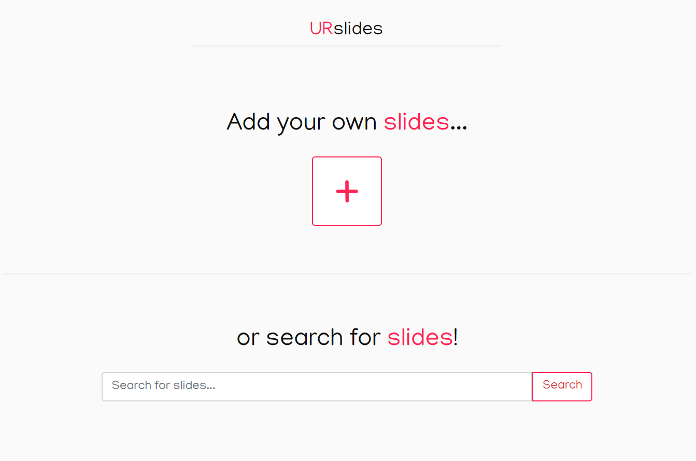
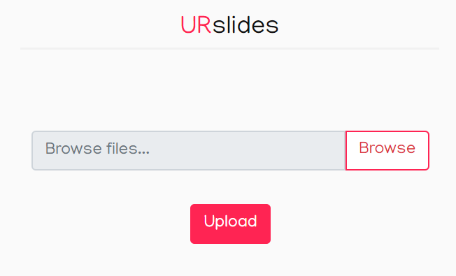
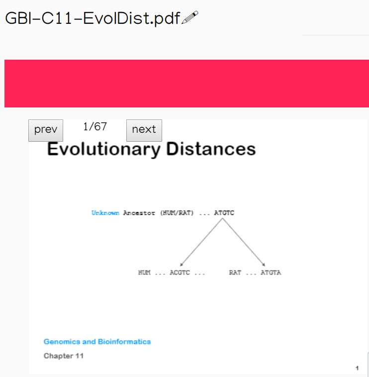
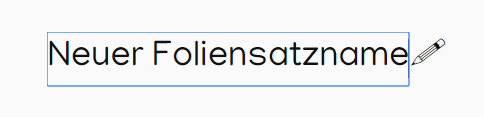
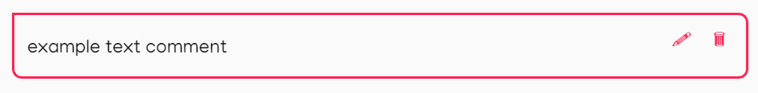
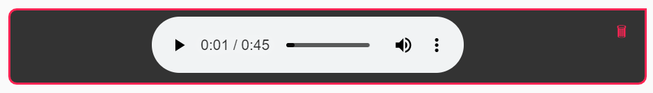
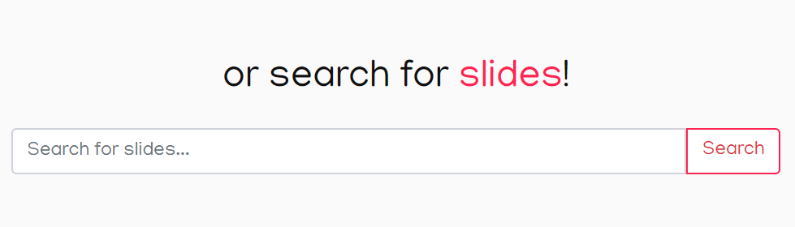

# URslides

Die Anwendung [*URslides*](http://localhost:8701) ermöglicht Dozierenden der Universität eine nachträgliche Verbesserung oder Ergänzung ihrer Foliensätze - Kommentare in der Form von Text oder Audio können veröffentlicht und so den Studierenden zugänglich gemacht werden. 

  

## Team

| | Infos | Implementierte Komponenten
|-|-|-|
 | **Stefan Braun** E-Mail: stefan.braun@student.ur.de Github-Nutzer: INazca | Stefan Braun hat die Komponente (...) implementiert. |
 | **Isabella Kreller** E-Mail: isabella.kreller@student.ur.de Github-Nutzer: kallutox | Isabella Kreller hat die Komponente (...) implementiert. |

## Setup

So nutzen Sie den vorgegebenen Server:

1. Führen Sie **einmalig** den Befehl `npm install` aus, um die notwendigen Abhängigkeiten (`express`) zu installieren.

2. Führen Sie den Befehl `npm start` aus um die Anwendung zu starten. Der Inhalt des `/app`-Verzeichnis ist anschließend über die die Adresse `http://localhost:8701/app` erreichbar.

[Beschreiben Sie alle Schritte, die notwendig sind um Ihre Anwendung auf Basis dieses Repositories zu starten.]

## Beschreibung und Features

URslides bietet den Benutzern die folgenden **Funktionen**:
 

- Das Hochladen von Foliensätzen im pdf-Format und deren persistente Speicherung in einer Datenbank

  

 

- Eine Ansicht für die Betrachtung der Foliensätze und das Durchblättern durch diese

  

 

- Das Ändern und Speichern des Dateinames in der Anwendung

  

 

- Die Erstellung von Kommentaren zu einzelnen Seiten seiner eigenen Foliensätze im Anschluss an dessen Upload
  - Textkommentare
  
  

    
  

   

  - Audiokommentare: Upload oder direkte Aufnahme
  
  

    
  

   

- Das Durchsuchen aller hochgeladenen Foliensätze anhand deren Namen

  

   
  

   

[Dokumentieren Sie ausführlich alle Funktionen der Anwendung. Verwenden Sie Screenshots und ggf. auch Gif-Dateien um zentrale Elemente und Abläufe zu beschreiben.]
